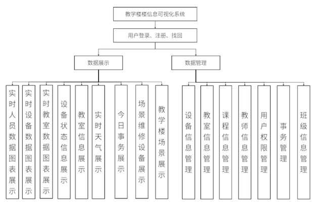
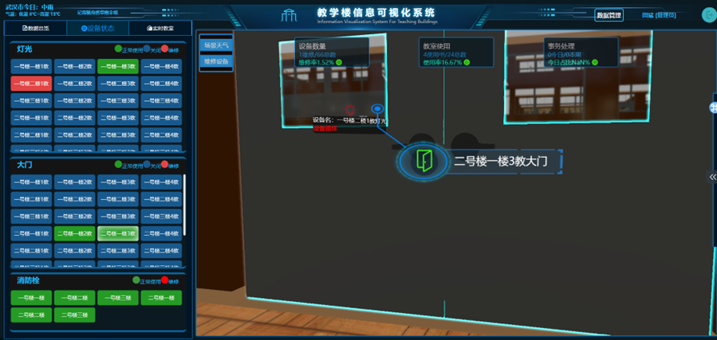
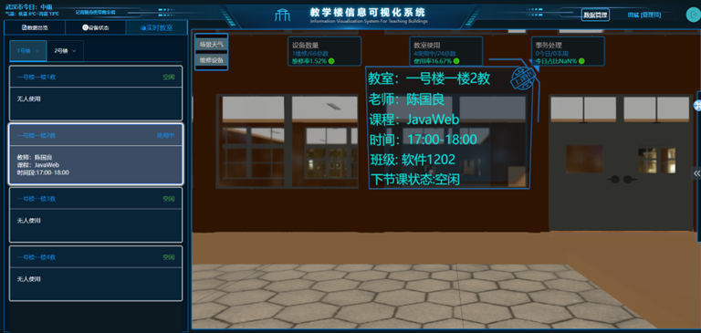
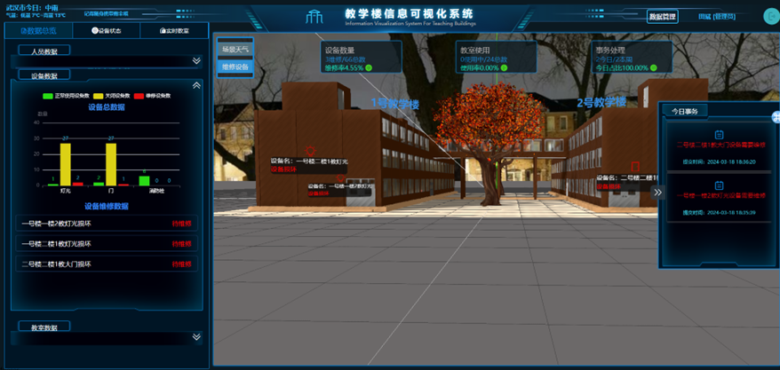
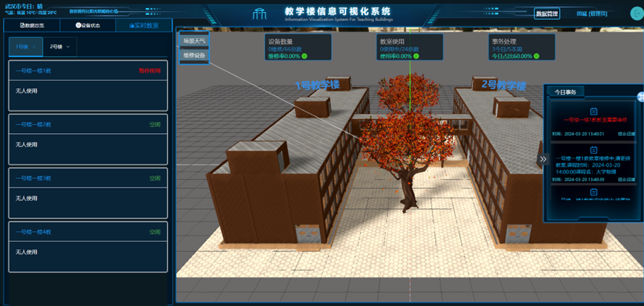
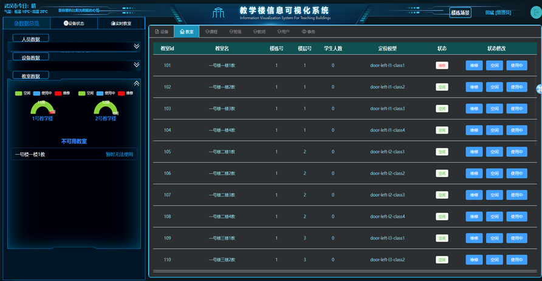
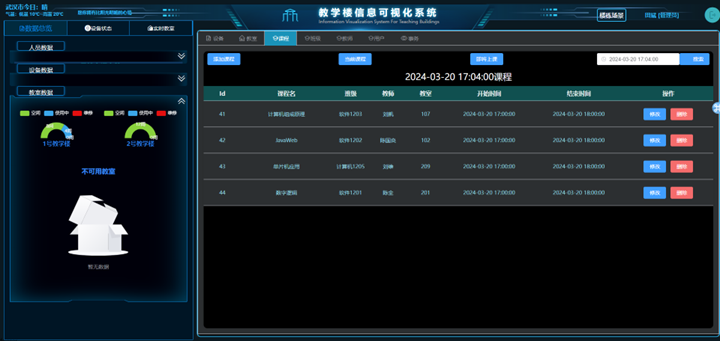
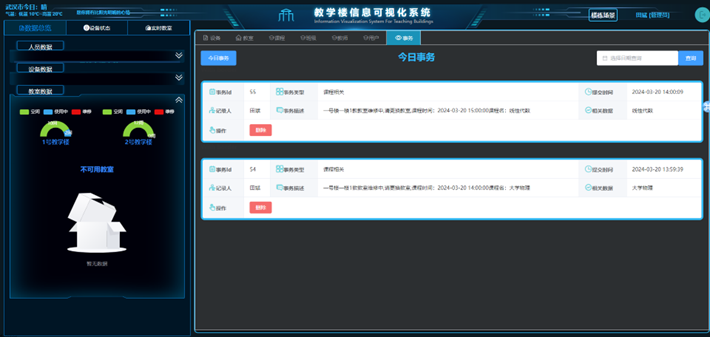

### 基于Threejs的教学楼信息可视化系统

设计目的：
- 本项目的主要目的是利用Three.js、Vue3和Java等技术，开发一个操作简便、数据直观的3D教学楼可视化管理系统。该系统旨在提供一个直观的3D视图来展示教学楼的内部布局和使用情况，包括教室分布、班级安排和设备状态等信息。通过这种方式，学校管理者可以更加高效地监控和调配校园资源，同时也为师生提供了一个更加便捷和直观的信息查询平台。通过对教学楼的3D可视化管理，学校管理者可以直观地了解各教室的使用状态和设备情况，从而更加合理地安排教学资源，提高资源利用率。对于师生来说，这个系统提供了一个直观的查询平台，他们可以轻松地了解到教室的位置、当前课程安排等信息，大大提升了信息获取的便利性和效率。相比于传统的管理系统，该项目的实施将有助于推动校园数字化转型，为教育信息化发展提供新的实践案例和研究素材。

设计意义：
- 3D教学楼可视化管理系统，在国内外教育信息化和校园管理领域中具有一定的实践和研究价值。它不仅能够提高校园管理的效率和质量，还能够优化教学资源的配置，改善师生的使用体验，并且为基于数据的决策提供支持。随着信息技术在教育领域的深入应用，此类项目的成功实施将为未来校园管理模式提供新的思路和方向。

现状分析：
- 国内外研究现状显示，3D可视化技术在校园管理和教学辅助方面的应用正在逐渐增多。在国际上，例如，一些大学已经采用虚拟现实（VR）和3D建模技术来创建虚拟校园环境，以提供更加直观和互动的学习体验。国内则有学校开始实验将3D技术应用于校园导航、安全演练等方面。 在国际范围内，3D可视化技术已被广泛用于教育、娱乐、建筑和医疗等多个领域。教育机构利用这项技术来创造更加互动和吸引人的学习环境。相比之下，中国在这一领域的应用还处于起步阶段，但发展速度很快，特别是在高等教育和职业教育领域。因此，此项目不仅符合当前的技术发展趋势，也具有较高的实用价值和创新性。

技术方案：
- 前端包括Vue3，TypeScript，Pinia，Threejs，Echarts等，后端包括：SpringBoot，MyBatis Plus，MySql等，3D模型由Blender进行处理，项目总体为前后端分离。
  
主要功能模块：
   - 1.用户登录、注册、找回
   - 2.人员数据、设备数据、教室数据图表展示
   - 3.实时设备状态展示
   - 3.实时教室信息展示
   - 4.场景维修设备展示
   - 5.场景天气展示（雨雪）
   - 6.实时事务展示
   - 7.场景课程信息展示
   - 8.后台数据管理（管理员、维修人员）
   - 功能模块图：

后台地址：
    - https://github.com/goofsT/Graduation-project-back

项目截图：

