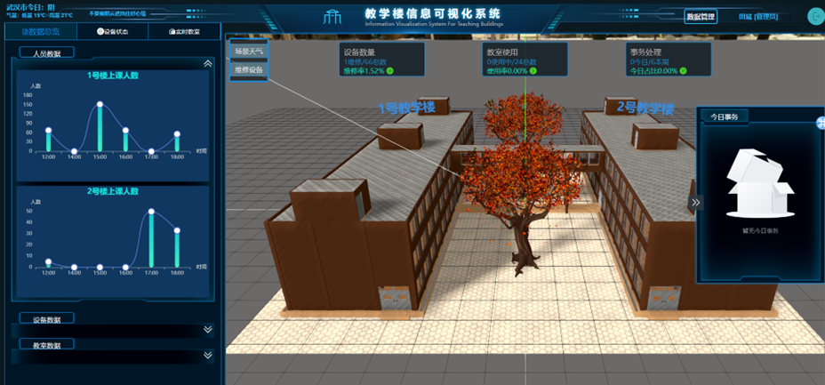

### 基于Threejs的教学楼信息可视化系统

设计目的：
- 本项目的主要目的是利用Three.js、Vue3和Java等技术，开发一个操作简便、数据直观的3D教学楼可视化管理系统。该系统旨在提供一个直观的3D视图来展示教学楼的内部布局和使用情况，包括教室分布、班级安排和设备状态等信息。

主要功能模块：
   - 1.用户登录、注册、找回
   - 2.人员数据、设备数据、教室数据图表展示
   - 3.实时设备状态展示
   - 3.实时教室信息展示
   - 4.场景维修设备展示
   - 5.场景天气展示（雨雪）
   - 6.实时事务展示
   - 7.场景课程信息展示
   - 8.后台数据管理（管理员、维修人员）
   - 功能模块图：

后台地址：
    - https://github.com/goofsT/Graduation-project-back

项目截图：

